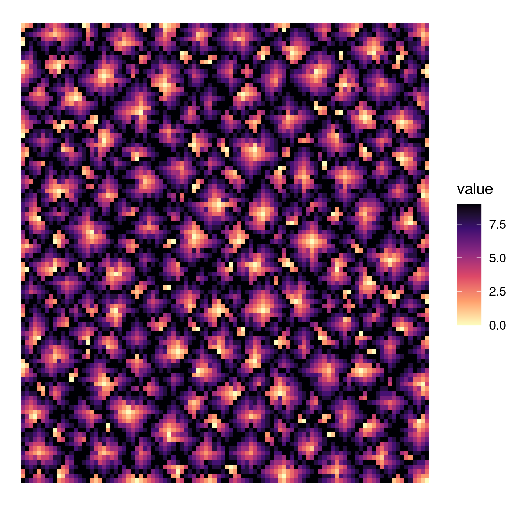
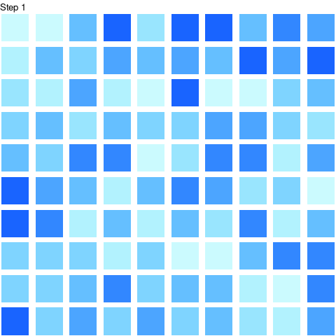
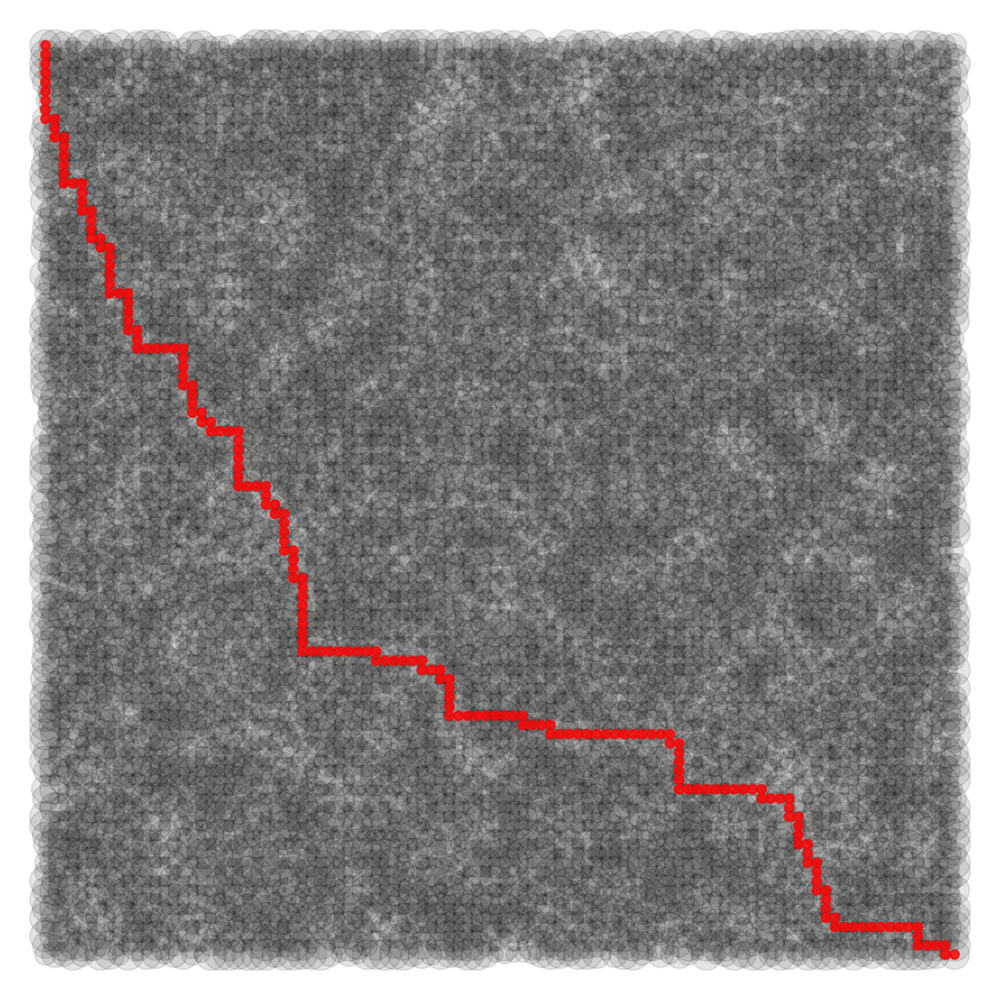

## Advent Of Code


### 2022

- Day06: un-relevant but useful function to create groups based on state changes using `rle`

### 2021

- Day02: Kara Woo used [R6 class](https://twitter.com/kara_woo/status/1468303906316775424?s=20)
- Day05: 
- Day06: Miles McBain interesting use of [lists](https://twitter.com/MilesMcBain/status/1468888082908782592?s=20).

And nice usage of `scan()`:

```r
fish_ages <- scan("input/06", what = integer(), sep = ",")
```

- Day07: David Robinson great [stat tricks](https://twitter.com/drob/status/1468247388238327822?s=20)

- Day09: 

- Day11: **David Robinson** [solution](https://twitter.com/drob/status/1469766453771522056?s=20)



- Day13: 

- Day15: 
