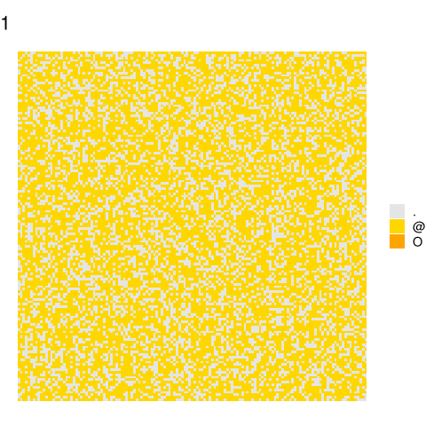
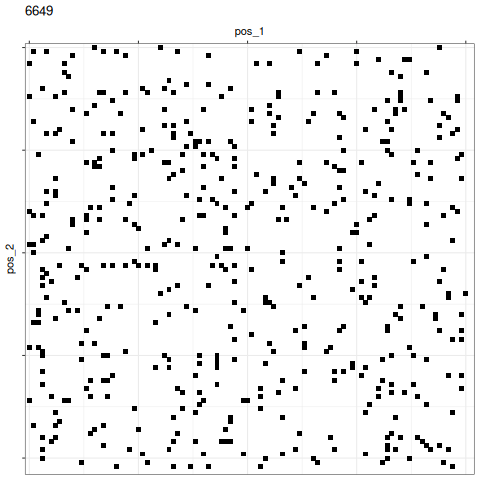
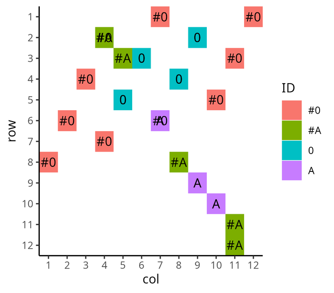
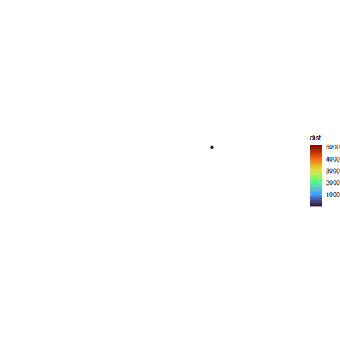
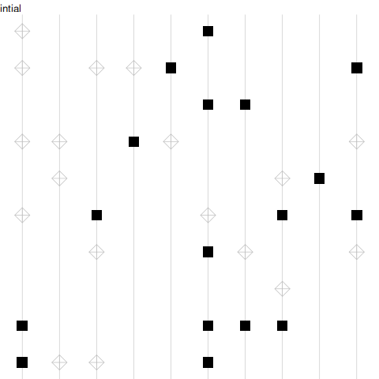
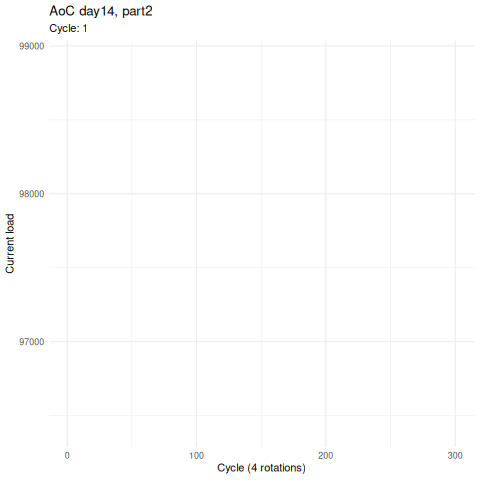
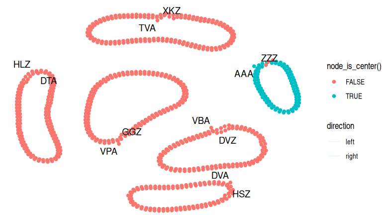
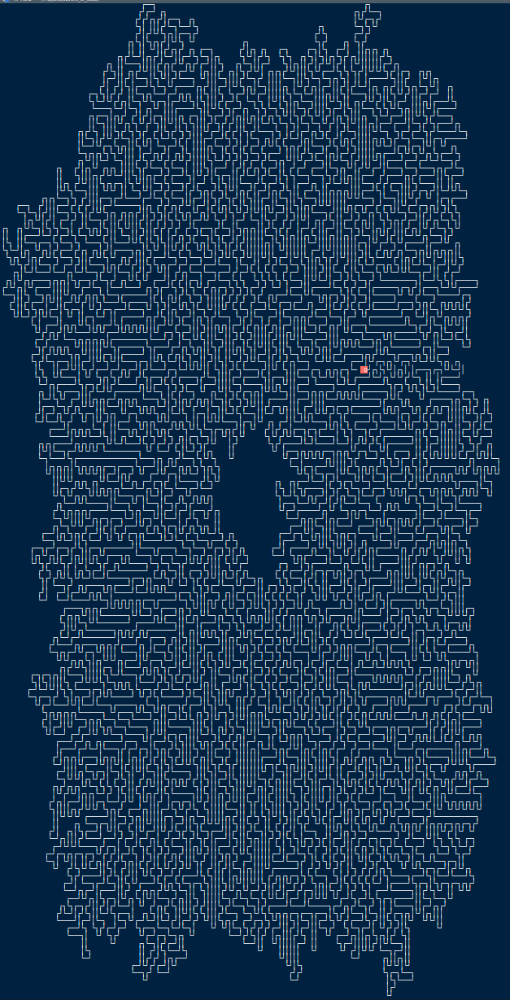

## Advent Of Code

### 2025

- Day04, "Printing Department"




### 2024

TODO: d15p1, d13

- Day14, Easter Egg



- Day08, antinodes of antennas



- Day06, guard moves



### 2023

- Day14, shifting mirrors part1



- Day14, shifting mirrors part2



- Day08, network for part2



- Day10, ASCII by using PY Berrard UTF-8 code trick



- Day05, part2 to be tried in Rust like [here](https://github.com/hgrsd/aoc2023/blob/main/src/bin/day5.rs)

### 2022

- Day06: irrelevant but useful function to create groups based on state changes using `rle`
- Day07, fail but need to try `R6` and also understand the `igraph` solution

### 2021

- Day02: Kara Woo used [R6 class](https://twitter.com/kara_woo/status/1468303906316775424?s=20)
- Day05: 
- Day06: Miles McBain interesting use of [lists](https://twitter.com/MilesMcBain/status/1468888082908782592?s=20).

And nice usage of `scan()`:

```r
fish_ages <- scan("input/06", what = integer(), sep = ",")
```

- Day07: David Robinson great [stat tricks](https://twitter.com/drob/status/1468247388238327822?s=20)

- Day09: 

- Day11: **David Robinson** [solution](https://twitter.com/drob/status/1469766453771522056?s=20)


- Day13: 

- Day15: 
